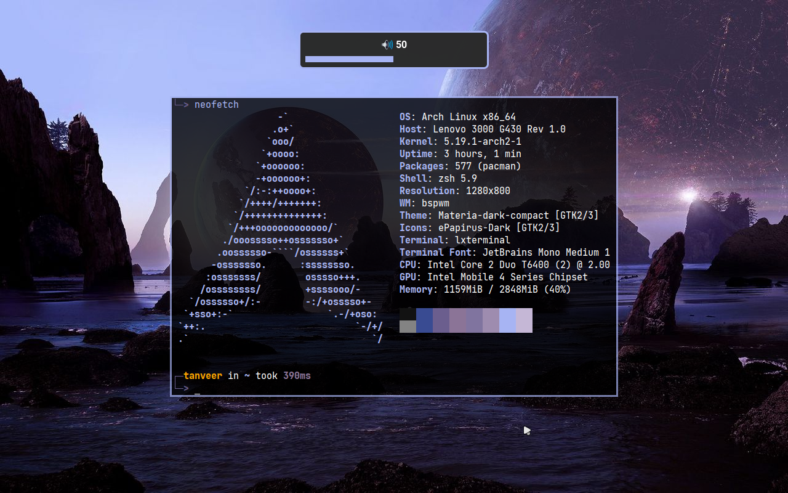

# coolterm

```txt
Usage:
    run [-t <term_name> | -f <format>] [<wallpaper_path>]
    run -h

Options:
    -h show helptext
    -t (lxterminal|st|kitty|xresources|nvim|shell)
    -f write custom format (e.g. "color%s %s")

custom format:
    if ur terminal/application is not in the above list, you can write ur own custom format to generate color pallete
    for e.g.: -f "color%s %s"
    		    	|  └─> color hex
    		    	└─> pallete number
nvim & shell:
    these ones are to be used with pywal.nvim plugin in neovim
```

# some examples




